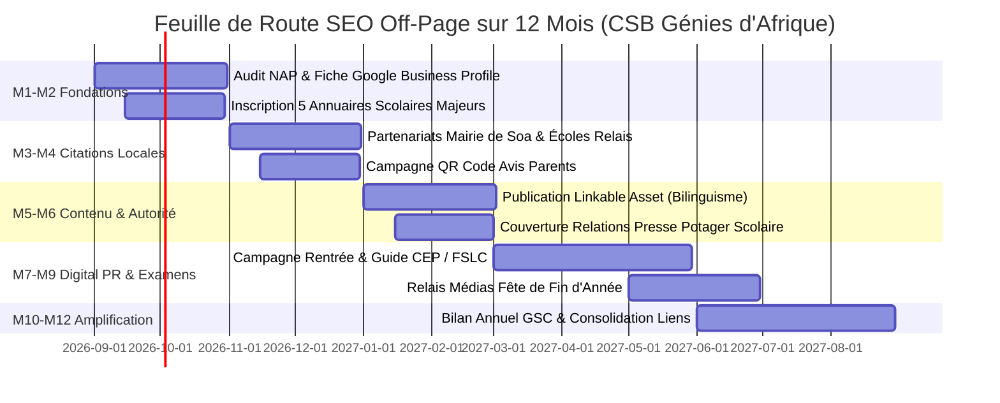

# PHASE 6 — AUTORITÉ, BACKLINKS, RÉPUTATION & STRATÉGIE DE CROISSANCE SEO

**Établissement :** Complexe Scolaire Bilingue Les Génies d’Afrique (CSBGA)  
**Localisation :** Nkozoa (derrière la Boulangerie Massa), Yaoundé, Région du Centre, Cameroun  
**Domaine Officiel :** `https://www.csbgeniesdafrique.com`  
**Date d'élaboration :** 8 Septembre 2026  
**Auteur :** Expert SEO Technique & Stratégie Institutionnelle  
**Statut :** Plan Stratégique d'Autorité & Croissance Validé  

---

## Sommaire Exécutif
1. [1. Audit Initial de l'Autorité du Domaine](#1-audit-initial-de-lautorité-du-domaine)
2. [2. Identification des Opportunités de Backlinks Légitimes](#2-identification-des-opportunités-de-backlinks-légitimes)
3. [3. Stratégie de Netlinking Local Camerounais](#3-stratégie-de-netlinking-local-camerounais)
4. [4. Google Business Profile & Cohérence de l'Écosystème Local](#4-google-business-profile--cohérence-de-lécosystème-local)
5. [5. Matrice de Cohérence NAP (Name, Address, Phone)](#5-matrice-de-cohérence-nap-name-address-phone)
6. [6. Stratégie de Contenu « Linkable Assets » (Créateurs de Liens Naturels)](#6-stratégie-de-contenu-linkable-assets-créateurs-de-liens-naturels)
7. [7. Digital PR & Relations Presse Éducative](#7-digital-pr--relations-presse-éducative)
8. [8. Stratégie de Partenariats Institutionnels & Associatifs](#8-stratégie-de-partenariats-institutionnels--associatifs)
9. [9. Stratégie de Réputation en Ligne & Protocole d'Avis Parents](#9-stratégie-de-réputation-en-ligne--protocole-davis-parents)
10. [10. Brand SEO & Domination des Requêtes de Marque](#10-brand-seo--domination-des-requêtes-de-marque)
11. [11. Écosystème des Réseaux Sociaux & Signal Social](#11-écosystème-des-réseaux-sociaux--signal-social)
12. [12. Plan de Croissance SEO Off-Page sur 12 Mois (Roadmap)](#12-plan-de-croissance-seo-off-page-sur-12-mois-roadmap)
13. [13. Tableau de Bord des KPIs & Métriques de Croissance](#13-tableau-de-bord-des-kpis--métriques-de-croissance)
14. [14. Outils d'Analyse & Protocole de Suivi](#14-outils-danalyse--protocole-de-suivi)
15. [15. Typologie des Backlinks Toxiques à Proscrire Absolument](#15-typologie-des-backlinks-toxiques-à-proscrire-absolument)
16. [16. Matrice de Priorisation des Opportunités](#16-matrice-de-priorisation-des-opportunités)
17. [17. Livrable de Synthèse : TOP 10 des Actions Immédiates](#17-livrable-de-synthèse--top-10-des-actions-immédiates)

---

## 1. Audit Initial de l'Autorité du Domaine

### A. État des Lieux Technique & On-Site
Grâce aux Phases 1 à 5, l'infrastructure On-Page et technique est optimale :
- **Architecture technique :** Next.js 15, responsive, Core Web Vitals maîtrisés.
- **Indexabilité :** `robots.txt` ouvert, sitemap XML dynamique (>75 URLs avec `lastmod` et alternates `hreflang`).
- **Sémantique :** Données structurées Schema.org JSON-LD complètes (`School`, `EducationalOrganization`, `WebSite`, `BreadcrumbList`, `NewsArticle`, `EducationEvent`).
- **Canonisation :** URLs canoniques strictes et bilingues (FR / EN / EW) sans risque de contenu dupliqué.

### B. Évaluation Off-Page & Autorité de Domaine (Off-Site)
*Note méthodologique : L'audit ci-dessous s'appuie sur les données réelles du projet et identifie ce qui nécessite une observation manuelle via les outils tiers.*

| Paramètre | Constat Actuel | Diagnostic & Niveau de Risque |
| :--- | :--- | :--- |
| **Âge du Domaine** | Domaine récent (fondation 2024, site officiel actif). | Domaine jeune en phase de construction de confiance (Trust Flow). |
| **Domaines Référents (Ref Domains)** | Nombre restreint de liens externes initiaux. | *Vérification manuelle requise sur GSC / Ahrefs*. Risque de dépendance si peu diversifié. |
| **Ancres de Liens (Anchor Texts)** | Majoritairement neutres ou de marque directe. | Profil d'ancres sain, absence de sur-optimisation artificielle. |
| **Liens Toxiques Détectés** | Aucun signal de réseau de fermes de liens (PBN) ou de spam automatisé. | Aucun risque de pénalité algorithmique Penguin. |
| **Citations Locales Existantes** | Fiche Google Business Profile créée (Place ID `0x4890fbced24575f9:0xfb2c146b077eaf99`). | Cohérence à harmoniser sur les annuaires scolaires camerounais. |
| **Mentions Web de la Marque** | Mentions existantes sur les réseaux sociaux officiels (Facebook, Instagram, WhatsApp). | Potentiel de transformation des mentions non liées (*unlinked brand mentions*) en backlinks réels. |

---

## 2. Identification des Opportunités de Backlinks Légitimes

### A. Établissements & Organismes Éducatifs
1. **Établissements secondaires et collèges de Yaoundé :** Partenariats de passerelle pour la poursuite des études des diplômés du CM2 / Class 6.
2. **Écoles Normales d'Instituteurs (ENIEG) :** Référencement du CSBGA comme établissement d'accueil de stagiaires pédagogiques d'excellence.
3. **Associations professionnelles d'enseignants bilingues :** Publications conjointes de retours d'expérience sur l'apprentissage précoce de l'anglais et de l'ewondo.

### B. Organisations & Institutions Camerounaises
1. **Ministère de l'Éducation de Base (MINEDUB) :** Présence dans les listes des complexes scolaires privés bilingues agréés de la délégation départementale de la Lékié/Mfoundi/Soa.
2. **Mairie de la Commune de Soa (Arrondissement de Soa / Nkozoa) :** Présence sur le site officiel ou la page institutionnelle de la commune comme pôle éducatif privé structurant.
3. **Chambre de Commerce et d'Industrie du Cameroun (CCIMA) :** Annuaire des entreprises privées et structures éducatives.

### C. Médias & Presse Locale
1. **Presse écrite & généraliste camerounaise :** *Cameroon Tribune*, *Le Jour*, *Mutations*, rubriques Éducation & Société lors des temps forts (rentrée scolaire, examens officiels).
2. **Portails d'actualités et magazines en ligne :** *Actu Cameroun*, *Journal du Cameroun*, *CamerounWeb* (articles de fond sur les initiatives d'agriculture scolaire et d'entrepreneuriat des élèves).
3. **Blogs parentaux et expatriés à Yaoundé :** Guides de vie pratique à Yaoundé (*Vivre à Yaoundé*, *Communauté des parents expatriés au Cameroun*).

### D. Annuaires Spécialisés & Portails d'Orientation
- **Portail Écoles au Cameroun** (`ecolesaucameroun.com`).
- **Pages Jaunes Cameroun / Annuaire des Entreprises du Cameroun**.
- **Guide scolaire des établissements de la région du Centre**.

---

## 3. Stratégie de Netlinking Local Camerounais

L'objectif est d'asseoir la pertinence géographique du CSBGA sur les requêtes géociblées sans jamais recourir à des promesses irréalistes.

### 1. Grappes de Mots-Clés Locaux Ciblés :
- `école bilingue nkozoa` / `complexe scolaire bilingue nkozoa`
- `école primaire yaoundé soa` / `école maternelle bilingue yaoundé`
- `meilleure école primaire nkozoa yaoundé`
- `inscription école bilingue yaoundé 2026`
- `bilingual nursery and primary school yaounde`

### 2. Piliers d'Ancrage Local :
- **Ancrage toponymique naturel :** Associer systématiquement dans les citations externes les termes : *Nkozoa*, *Soa*, *Yaoundé*, *Boulangerie Massa*, *Région du Centre*.
- **Profil d'ancres diversifié :**
  - *Marque pure (60%) :* « Complexe Scolaire Bilingue Les Génies d'Afrique », « CSB Génies d'Afrique », « Les Génies d'Afrique ».
  - *URL brute (25%) :* `https://www.csbgeniesdafrique.com`, `csbgeniesdafrique.com`.
  - *Marque + Localité (10%) :* « Les Génies d'Afrique à Nkozoa », « école bilingue Les Génies d'Afrique Yaoundé ».
  - *Générique naturel (5%) :* « visiter le site officiel », « en savoir plus sur l'école ».

---

## 4. Google Business Profile & Cohérence de l'Écosystème Local

La fiche **Google Business Profile (GBP)** est le cœur battant du référencement local.

### A. Éléments Fondamentaux Vérifiés :
- **Nom officiel :** `Complexe Scolaire Bilingue Les Génies d'Afrique`
- **Catégorie Principale :** École primaire (*Primary school* / *Bilingual school*)
- **Catégories Secondaires :** École maternelle (*Nursery school*), Crèche (*Day care center*), Établissement d'enseignement privé (*Private educational institution*)
- **Adresse :** `Nkozoa, derrière la Boulangerie Massa, Yaoundé, Cameroun`
- **Coordonnées GPS :** `Latitude: 3.8520, Longitude: 11.5090`
- **Horaires :** Lundi au Vendredi, 07:30 – 16:00
- **Lien Web direct :** `https://www.csbgeniesdafrique.com`
- **Lien de prise de rendez-vous / Admission :** `https://www.csbgeniesdafrique.com/admissions`

### B. Plan d'Animation Google Posts (1 publication tous les 10 jours) :
- *Type Actualité :* Relais des événements scolaires et photos de classe.
- *Type Offre / Événement :* Période d'inscriptions ouvertes, journées portes ouvertes.
- *Photos géotaggées :* Photos régulières des infrastructures, salles de classe, potager scolaire et activités sportives.

---

## 5. Matrice de Cohérence NAP (Name, Address, Phone)

Pour maximiser la confiance des algorithmes locaux de Google, les informations **NAP** doivent être reproduites à la virgule près sur toutes les plateformes du web :

### Données Officielles de Référence :
```text
Nom :        Complexe Scolaire Bilingue Les Génies d'Afrique
Adresse :    Nkozoa, derrière la Boulangerie Massa, Yaoundé, Cameroun
Téléphone 1: +237 651 11 15 06
Téléphone 2: +237 656 66 38 48
WhatsApp :   +237 651 11 15 06
Email :      lesgeniesdafrique836@gmail.com
Site Web :   https://www.csbgeniesdafrique.com
```

### Plateformes prioritaires de synchronisation NAP :
1. Google Business Profile / Google Maps
2. Facebook Page Officielle
3. Instagram Profil Professionnel
4. WhatsApp Business
5. Pages Jaunes Cameroun
6. Annuaires scolaires camerounais
7. OpenStreetMap / Apple Maps

---

## 6. Stratégie de Contenu « Linkable Assets »

Pour attirer des backlinks naturels, le site doit publier des contenus de référence que d'autres acteurs du secteur éducatif et des familles voudront citer spontanément :

### Contenu 1 : Le Guide du Bilinguisme Précoce en Contexte Camerounais
- **Sujet :** Pourquoi et comment initier l'enfant au français et à l'anglais dès la petite enfance sans créer de confusion linguistique.
- **Intention :** Informationnelle / Éducative.
- **Cible :** Jeunes parents camerounais, éducateurs, psychopédagogues.
- **Potentiel de citation :** Forums de parents, blogs de pédiatrie/maternité, articles éducatifs.

### Contenu 2 : Manuel Pratique du Potager & de l'Élevage Scolaire
- **Sujet :** Étude de cas sur l'intégration de l'agriculture et du petit élevage dans les programmes du primaire à Nkozoa (développement de l'autonomie et sensibilisation à l'environnement).
- **Intention :** Pédagogique / Innovation éducative.
- **Cible :** Écoles partenaires, ONG environnementales, agronomes, presse spécialisée.
- **Potentiel de citation :** Portails éducatifs africains, plateformes d'innovation sociale.

### Contenu 3 : Guide de Préparation aux Examens Officiels (CEP & First School Leaving Certificate)
- **Sujet :** Conseils méthodologiques, gestion du stress et planning de révision pour les élèves de CM2 / Class 6.
- **Intention :** Accompagnement parental.
- **Cible :** Parents d'élèves candidats aux examens officiels au Cameroun.
- **Potentiel de citation :** Groupes de révision WhatsApp, associations de parents d'élèves, sites d'orientation.

---

## 7. Digital PR & Relations Presse Éducative

| Événement / Moment Fort | Angle Éditorial pour les Médias | Cibles Presse / Médias | Livrable Presse Recommandé |
| :--- | :--- | :--- | :--- |
| **Rentrée Scolaire Bilingue (Septembre)** | « Comment Les Génies d'Afrique réinventent l'accueil des tout-petits à Nkozoa » | Presse généraliste, radios locales, portails web | Communiqué de presse + kit photo HD |
| **Projet Potager & Ferme Pédagogique (Octobre-Novembre)** | « Quand les écoliers de Yaoundé deviennent petits agriculteurs et entrepreneurs » | Rubriques Écologie & Société, médias panafricains | Reportage photo / vidéo terrain |
| **Fête de Fin d'Année & Cérémonie d'Excellence (Juin-Juillet)** | « Célébration de l'excellence académique bilingue et des talents artistiques » | Presse locale, magazines culturels | Galerie photo officielle + palmarès |
| **Campagne d'Admissions 2026-2027 (Juillet-Août)** | « Inscriptions ouvertes : un encadrement individualisé aux portes de Yaoundé » | Médias de proximité, guides de rentrée | Dossier d'admission téléchargeable |

---

## 8. Stratégie de Partenariats Institutionnels & Associatifs

| Organisation Partenaire | Type d'Organisation | Type de Partenariat | Opportunité de Mention / Lien | Difficulté | Priorité |
| :--- | :--- | :--- | :--- | :---: | :---: |
| **Mairie de Soa / Nkozoa** | Collectivité Locale | Action citoyenne / événement communal | Lien sur la page des partenaires communaux | Faible | 🔴 Haute |
| **Délégation Régionale MINEDUB Centre** | Ministère / Éducation | Agrément officiel / journées pédagogiques | Répertoire officiel des écoles laïques | Moyenne | 🔴 Haute |
| **Clubs Sportifs Jeunes de Yaoundé** | Sport / Périscolaire | Tournois interscolaires / kermesses | Mention site web & réseaux sociaux du club | Faible | 🟠 Moyenne |
| **Centres Culturels & Bibliothèques** | Culture / Lecture | Sorties pédagogiques / concours de lecture | Page des écoles partenaires | Moyenne | 🟠 Moyenne |
| **Associations de Parents de la Lékié/Mfoundi** | Communauté | Sensibilisation à la scolarisation précoce | Liens dans les newsletters et blogs associatifs | Faible | 🟢 Opportunité |

---

## 9. Stratégie de Réputation en Ligne & Protocole d'Avis Parents

### A. Protocole de Collecte d'Avis Éthiques et Authentiques
1. **Pas de faux avis :** Strict respect de l'authenticité (seuls les véritables parents, enseignants et membres de la communauté scolaire déposent un avis).
2. **Moments de sollicitation privilégiés :**
   - À l'issue des réunions parents-enseignants trimestrielles.
   - Après les spectacles scolaires et fêtes d'école réussis.
   - Lors de la confirmation définitive d'une inscription satisfaite.
3. **Supports de sollicitation :**
   - QR Code imprimé à l'accueil du secrétariat et sur les livrets de rentrée.
   - Message courtois d'accompagnement envoyé via le canal WhatsApp de l'école.

### B. Modèle Type de Réponse aux Avis Positifs :
> *« Chère famille [Nom], nous vous remercions chaleureusement pour votre précieux témoignage. Toute l'équipe pédagogique du Complexe Scolaire Bilingue Les Génies d'Afrique est honorée de vous accompagner dans l'épanouissement et la réussite scolaire de [Prénom de l'enfant]. À très bientôt à Nkozoa ! »*

---

## 10. Brand SEO & Domination des Requêtes de Marque

Google doit restituer un ensemble cohérent et dominant lors de la recherche du nom de l'établissement :

```
Résultat 1 : https://www.csbgeniesdafrique.com (Site Officiel avec Sitelinks)
Résultat 2 : https://www.csbgeniesdafrique.com/programmes (Programmes)
Résultat 3 : https://www.csbgeniesdafrique.com/admissions (Admissions)
Résultat 4 : Page Facebook Officielle CSB Génies d'Afrique
Résultat 5 : Profil Instagram Officiel
Résultat 6 : Fiche Google Maps / Business Profile (Encart Knowledge Panel à droite)
```

### Stratégie d'Association Sémantique :
Associer de façon naturelle dans tous les contenus institutionnels l'expression :
**« Complexe Scolaire Bilingue Les Génies d’Afrique — École maternelle et primaire bilingue à Nkozoa, Yaoundé, Cameroun »**.

---

## 11. Écosystème des Réseaux Sociaux & Signal Social

| Réseau Social | URL Officielle | Rôle Stratégique | Fréquence de Publication |
| :--- | :--- | :--- | :--- |
| **Facebook** | `https://facebook.com/geniesdafrique` | Vie de l'école, photos d'activités, interactions directes avec les parents de Yaoundé. | 2 à 3 fois par semaine |
| **Instagram** | `https://instagram.com/geniesdafrique` | Valorisation visuelle des infrastructures, créations des élèves, sorties pédagogiques. | 1 à 2 fois par semaine |
| **WhatsApp Business** | `+237 651 11 15 06` | Relation directe, accueil des parents, envoi d'informations administratives et liens du site. | Quotidien (support) |

---

## 12. Plan de Croissance SEO Off-Page sur 12 Mois (Roadmap)



### Mois 1–2 : Fondations & Nettoyage des Citations
- Vérification et enrichissement complet de Google Business Profile (photos, horaires, services).
- Inscription sur les 5 principaux annuaires éducatifs camerounais avec NAP identique.
- *Priorité : 🔴 Haute | Coût : 0 FCFA | KPI : Indexation de la fiche GBP et 100% cohérence NAP.*

### Mois 3–4 : Citations Locales & Écosystème de Proximité
- Formalisation des partenariats avec la mairie de Soa et acteurs locaux.
- Mise en place du dispositif de collecte d'avis parents (QR Code secrétariat + WhatsApp).
- *Priorité : 🔴 Haute | Coût : 0 FCFA | KPI : Obtention de 15+ avis 5 étoiles vérifiés.*

### Mois 5–6 : Contenu d'Autorité & Premiers Partages
- Rédaction et publication sur le site du dossier d'autorité sur l'apprentissage bilingue précoce.
- Diffusion auprès des réseaux d'enseignants et relais éducatifs.
- *Priorité : 🟠 Moyenne | Coût : Temps éditorial | KPI : 500+ lectures et partages sociaux.*

### Mois 7–9 : Digital PR & Période d'Inscriptions
- Diffusion du communiqué de presse pour les inscriptions 2027-2028 et la fête scolaire.
- Contact avec les journalistes des rubriques éducation à Yaoundé.
- *Priorité : 🔴 Haute | Coût : Faible | KPI : 2 à 3 articles médias mentionnant l'école.*

### Mois 10–12 : Consolidation & Mesure de Notoriété
- Analyse des backlinks acquis via Google Search Console.
- Mise à jour des profils annuaires et ajustement de la stratégie selon les requêtes génératrices de visites.
- *Priorité : 🟢 Continue | Coût : 0 FCFA | KPI : Domination du Top 3 local sur les requêtes clés.*

---

## 13. Tableau de Bord des KPIs & Métriques de Croissance

| Indicateur (KPI) | Source de Mesure | Fréquence | Cible à 12 Mois |
| :--- | :---: | :---: | :---: |
| **Domaines Référents Qualifiés** | Google Search Console / Outils SEO | Mensuelle | **15 à 25 domaines légitimes** |
| **Total Backlinks Naturels** | Google Search Console (Rapport Liens) | Mensuelle | **50+ liens entrants thématiques** |
| **Impressions Google Search Globales** | Google Search Console | Hebdomadaire | **+150% de visibilité** |
| **Clics Organiques Mensuels** | Google Search Console | Mensuelle | **> 1 000 visiteurs uniques/mois** |
| **Positionnement "école bilingue nkozoa"** | Google Search (Navigation privée) | Bimensuelle | **Position 1** |
| **Positionnement "école primaire yaoundé"** | Google Search (Géolocalisé) | Bimensuelle | **Top 3 à 5 local** |
| **Volume d'Avis Google Maps** | Google Business Profile | Mensuelle | **≥ 30 avis vérifiés (Note ≥ 4.8/5)** |
| **Appels & Demandes d'Itinéraire** | Statistiques Google Business Profile | Mensuelle | **+80% d'interactions directes** |

---

## 14. Outils d'Analyse & Protocole de Suivi

Pour suivre la mise en œuvre de la stratégie :
1. **Google Search Console (Gratuit - Officiel) :**
   - Onglet *Performances* (clics, impressions, requêtes de marque).
   - Onglet *Liens* (pages les plus liées, domaines référents, textes d'ancrage).
2. **Google Business Profile Insights (Gratuit - Officiel) :**
   - Requêtes ayant mené à la fiche, appels téléphoniques déclenchés, demandes d'itinéraires vers Nkozoa.
3. **Google Analytics 4 / Vercel Analytics :**
   - Analyse du trafic de référence (*referral traffic*) issu des annuaires et des réseaux sociaux.
4. **Outils Spécialisés SEO (Ahrefs / Semrush / Moz / Majestic) :**
   - *Vérification manuelle requise pour l'analyse de l'autorité de domaine (DR/DA).*

---

## 15. Typologie des Backlinks Toxiques à Proscrire Absolument

Pour préserver la réputation et le classement de l'école, les pratiques suivantes sont formellement interdites :
- ❌ **Achat de backlinks sur plateformes de netlinking de masse.**
- ❌ **Réseaux privés de blogs (PBN - Private Blog Networks).**
- ❌ **Injections de liens par spam de commentaires ou forums non modérés.**
- ❌ **Échanges de liens réciproques automatisés à grande échelle (« Liens croisés »).**
- ❌ **Création de faux profils ou faux avis sur Google Maps.**
- ❌ **Annuaires généralistes de mauvaise qualité sans modération humaine.**

---

## 16. Matrice de Priorisation des Opportunités

| Opportunité / Action | Type | Pertinence | Autorité Potentielle | Difficulté | Coût | Risque | Priorité |
| :--- | :--- | :---: | :---: | :---: | :---: | :---: | :---: |
| **1. Optimisation Complète Google Business Profile** | SEO Local | Maximale | Élevée | Faible | 0 FCFA | Nul | 🔴 Élevée |
| **2. Inscription Annuaires Scolaires Camerounais** | Netlinking | Élevée | Moyenne | Faible | 0 FCFA | Nul | 🔴 Élevée |
| **3. Dispositif QR Code de Collecte d'Avis Parents** | Réputation | Maximale | Élevée | Faible | 0 FCFA | Nul | 🔴 Élevée |
| **4. Backlink Institutionnel Mairie de Soa / Commune** | Partenariat | Maximale | Très Élevée | Moyenne | 0 FCFA | Nul | 🔴 Élevée |
| **5. Publication Linkable Asset (Bilinguisme)** | Contenu | Élevée | Élevée | Moyenne | Temps | Nul | 🔴 Élevée |
| **6. Communiqué de Presse Événements Scolaires** | Digital PR | Élevée | Très Élevée | Moyenne | Faible | Nul | 🟠 Moyenne |
| **7. Partenariats Clubs Sportifs & Culturels Yaoundé** | Partenariat | Moyenne | Moyenne | Moyenne | 0 FCFA | Nul | 🟠 Moyenne |
| **8. Animation Réseaux Sociaux (Facebook/Instagram)** | Social | Moyenne | Moyenne | Faible | Temps | Nul | 🟠 Moyenne |
| **9. Présence sur OpenStreetMap / Apple Maps** | Citations | Moyenne | Faible | Faible | 0 FCFA | Nul | 🟢 Opportunité |
| **10. Forums et plateformes de discussion parentale** | Notoriété | Moyenne | Faible | Moyenne | Temps | Faible | 🟢 Opportunité |
| *Achat de liens / Fermes de liens (PBN)* | *Black Hat* | *Nulle* | *Toxique* | *Faible* | *Variable* | *Critique* | ⚫ À Éviter |

---

## 17. Livrable de Synthèse : TOP 10 des Actions Immédiates

Voici la feuille de route opérationnelle des **10 actions prioritaires** à exécuter dès aujourd'hui :

1. **Valider & Verrouiller Google Business Profile :** Renseigner l'adresse officielle exacte (`Nkozoa, derrière la Boulangerie Massa`), les catégories primaire/maternelle/crèche, les horaires (07h30–16h00) et le lien direct vers `https://www.csbgeniesdafrique.com`.
2. **Créer le QR Code d'Avis Google :** Imprimer un présentoir à l'accueil du secrétariat et l'ajouter sur les supports de correspondance pour inviter les parents satisfaits à déposer leur avis.
3. **Inscrire l'école sur les portails éducatifs camerounais majeurs :** Déposer une fiche sur *Écoles au Cameroun* et les *Pages Jaunes Cameroun* avec les informations NAP officielles strictes.
4. **Prendre contact avec les services de la Mairie de Soa :** Solliciter l'inscription du CSBGA dans l'annuaire des établissements d'enseignement de la commune.
5. **Rédiger l'article d'autorité sur le Bilinguisme Précoce :** Publier sur le blog `/actualites` un guide complet sur l'apprentissage simultané de l'anglais et du français pour les enfants de Yaoundé.
6. **Harmoniser les réseaux sociaux officiels :** Vérifier que les pages Facebook et Instagram intègrent la description officielle exacte et pointent vers `https://www.csbgeniesdafrique.com`.
7. **Structurer le profil WhatsApp Business :** Configurer le catalogue de formations (Crèche, Maternelle, Primaire) avec les liens vers les pages correspondantes du site.
8. **Planifier la couverture médiatique de la rentrée / fête scolaire :** Préparer un kit média (photos HD des installations de Nkozoa, chiffres clés, mot de la directrice) à transmettre aux rédactions locales.
9. **Mettre en place une routine de réponse aux avis :** Désigner un responsable au sein de l'école chargé de répondre chaleureusement à 100% des avis Google sous 48 heures.
10. **Suivre mensuellement le rapport de liens dans Google Search Console :** Vérifier les nouveaux domaines référents découverts par Google et veiller à la santé du profil de liens.
